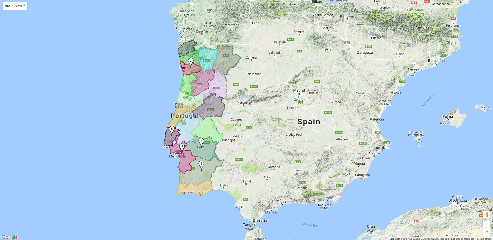
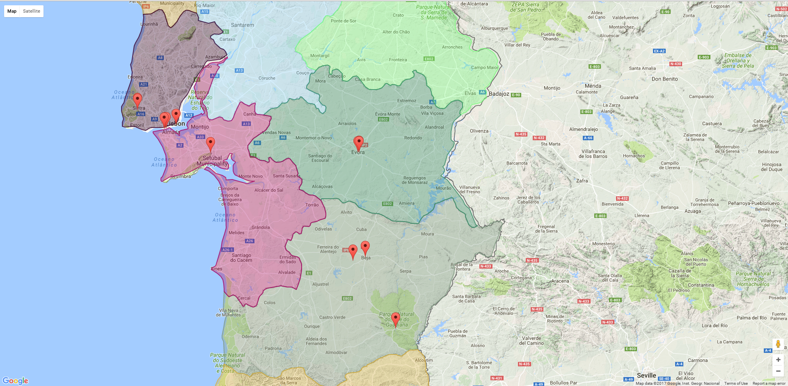

    $$$$$$$\            $$\                                                                                                              
    $$  __$$\           $$ |                                                           $$\                                               
    $$ |  $$ | $$$$$$\  $$ |$$\   $$\  $$$$$$\   $$$$$$\  $$$$$$$\   $$$$$$$\          $$ |                                              
    $$$$$$$  |$$  __$$\ $$ |$$ |  $$ |$$  __$$\ $$  __$$\ $$  __$$\ $$  _____|      $$$$$$$$\                                            
    $$  ____/ $$ /  $$ |$$ |$$ |  $$ |$$ /  $$ |$$ /  $$ |$$ |  $$ |\$$$$$$\        \__$$  __|                                           
    $$ |      $$ |  $$ |$$ |$$ |  $$ |$$ |  $$ |$$ |  $$ |$$ |  $$ | \____$$\          $$ |                                              
    $$ |      \$$$$$$  |$$ |\$$$$$$$ |\$$$$$$$ |\$$$$$$  |$$ |  $$ |$$$$$$$  |         \__|                                              
    \__|       \______/ \__| \____$$ | \____$$ | \______/ \__|  \__|\_______/                                                            
                            $$\   $$ |$$\   $$ |                                                                                         
                            \$$$$$$  |\$$$$$$  |                                                                                         
                             \______/  \______/                                                                                          
    $$\      $$\                     $$\                                  $$$$$$\  $$\                       $$\                         
    $$$\    $$$ |                    $$ |                                $$  __$$\ $$ |                      $$ |                        
    $$$$\  $$$$ | $$$$$$\   $$$$$$\  $$ |  $$\  $$$$$$\   $$$$$$\        $$ /  \__|$$ |$$\   $$\  $$$$$$$\ $$$$$$\    $$$$$$\   $$$$$$\  
    $$\$$\$$ $$ | \____$$\ $$  __$$\ $$ | $$  |$$  __$$\ $$  __$$\       $$ |      $$ |$$ |  $$ |$$  _____|\_$$  _|  $$  __$$\ $$  __$$\ 
    $$ \$$$  $$ | $$$$$$$ |$$ |  \__|$$$$$$  / $$$$$$$$ |$$ |  \__|      $$ |      $$ |$$ |  $$ |\$$$$$$\    $$ |    $$$$$$$$ |$$ |  \__|
    $$ |\$  /$$ |$$  __$$ |$$ |      $$  _$$<  $$   ____|$$ |            $$ |  $$\ $$ |$$ |  $$ | \____$$\   $$ |$$\ $$   ____|$$ |      
    $$ | \_/ $$ |\$$$$$$$ |$$ |      $$ | \$$\ \$$$$$$$\ $$ |            \$$$$$$  |$$ |\$$$$$$  |$$$$$$$  |  \$$$$  |\$$$$$$$\ $$ |      
    \__|     \__| \_______|\__|      \__|  \__| \_______|\__|             \______/ \__| \______/ \_______/    \____/  \_______|\__|      
                                                                                                                                         
                                                                                                                                         

# Description

This project is a demo of how you can attach polygons for regions in Google Maps, 
and how you can have clusters of Markers. 

In this sample, you can see Portugal divided by its districts, as well as some
points of interested marked.

When zommed out, the markers are clustered.

When zoomed in, the cluster dissipates so you can see each marker individually.

# Documentation

All the documentation for this demo can be seen at the [Official Docs](https://fl4m3ph03n1x.github.io/marker-cluster-polygon/index.html).

The documentation was automatically generated using [docstrap](https://github.com/docstrap/docstrap) in conjunction 
with [jsdoc](http://usejsdoc.org/).

# License

This work is udner the [MIT license](https://choosealicense.com/licenses/mit/). 