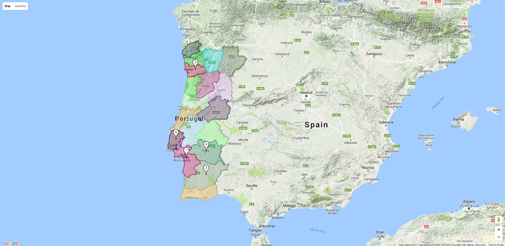

# Polygon + Marker Cluster

## Description

This project is a demo of how you can attach polygons for regions in Google Maps, 
and how you can have clusters of Markers. 

In this sample, you can see Portugal divided by its districts, as well as some
points of interested marked.

When zommed out, the markers are clustered.

When zoomed in, the cluster dissipates so you can see each marker individually.

## Install

Download all the files (except the `docs` folder) and **make sure you change the API key**
under `index.html` to your own:

    

This line is in the `<head>` section and it will define wether or not this demo 
will work for you or not.

## Usage

To use it, open the `index.html` file with a browser of your choice and enjoy. 
This is mainly a front-end project, so no additional setup is needed. 

## JavaScript Code

The following files are under the directory `js` and they represent the logic of 
this demo:

 - `data/poiData.js` is the file containing the data for the points of interest. To find the coordinates of a point of interest you can use https://google-developers.appspot.com/maps/documentation/utils/geocoder/
 - `data/districtData.js` constains the coordinates that define the district's polygon shape.
 - `geometry/coordinate.js` representes a coordinate object.
 - `geometry/polygon.js` represents a polygon object. Contains mathematical calculations for polygons.
 - `utils/randomColor.js` contains a function to help generete random strings of colors.
 - `libs/markermanager.js` is my library for managing marker objects from the Google Maps API.  
 - `myscript.js` is responsible for creating the polygons and clustering the marks. Depends on `markermanager.js`.
 - 

# License

This work is udner the [MIT license](https://choosealicense.com/licenses/mit/). 